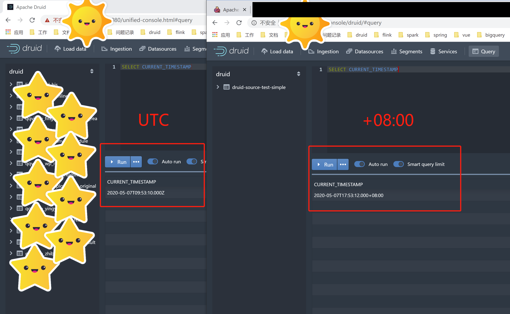
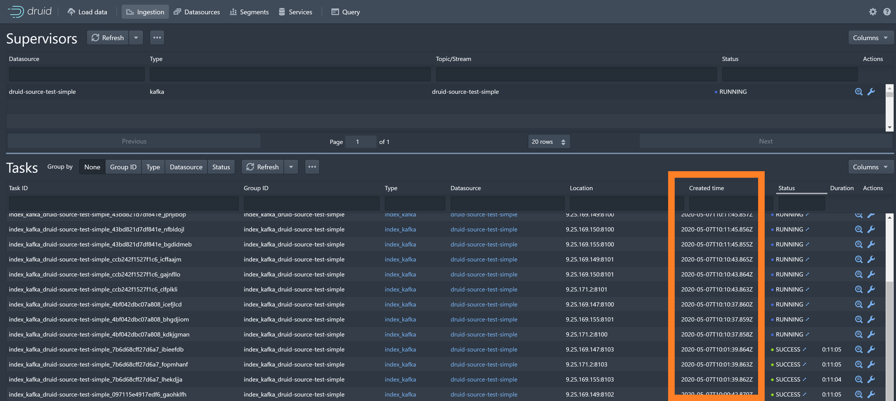

# druid 时区问题
## 1. druid 时区
 - druid默认UTC时区
## 2. broker 查询时区修改
 - 官方不建议修改jvm.config参数中的时区, 可以在query的时候设置时区
    - 官网给的最佳实践: [JVM Configuration Best Practices](https://druid.apache.org/docs/latest/configuration/index.html#jvm-configuration-best-practices)
    - **如果改变时区会触发神奇的bug**
    - 底层数据存时间戳,根据客户端TimeZone展示
 - broker时区设置
    - ${DRUID_HOME}/conf/druid/cluster/query/broker/runtime.properties
        - druid.sql.planner.sqlTimeZone=Asia/Shanghai
        - 效果图
            - 
## 3. 前端界面(ingestion) created_time 时区
 - created_time 是 MiddleManager创建Peon进程的时间,会被记录到MateData (MySQL)中, 默认UTC; ui传sql查询,暂时没有找到更改办法.
    - 
 