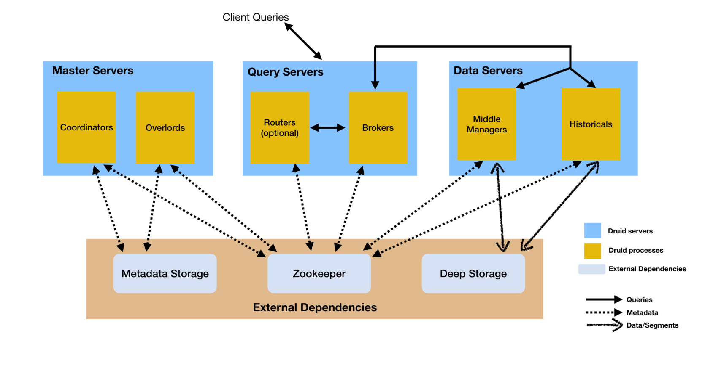

# Design
 - ```text
   Druid 是一个多进程, 分布式, 被设计成云友好且易操作.
   每一个Druid进程都能独立的配置和独立伸缩, 给你最大的自由度.
   这样的设计同样增强了容错能力: 一个组件失效不会直接影响其他组件.
   ```
# Process and Servers

Druid 有几种进程类型, 如下:
 - [Coordinator](./05-Coordinator-Process.md)
 - Overload
 - Broker
 - Router
 - [Historical](./06-Historical-Process.md)
 - MiddleManager 
 
Druid 进程能被任意部署, 但是为了部署简单, 我们推荐区分三种Server Type: 
 - Master
    - Run Coordinator and Overload process.
 - Query
    - Run Broker and optional Router process.
 - Data
    - Run Historical and MiddleManager process.

# External dependencies

# Deep storage
 - Druid 使用 deep storage 存储ingested数据, deep storage 可以是hdfs, s3 等分布式文件系统.
 - Druid 使用 deep storage **仅作为数据的备份, 用来在后台进程间(historical)数据传输的方式**.
 - To respond to queries(响应查询), **historical 不能read from deep storage,而是从historical本地磁盘获取segment**. 这意味着Druid 查询时不需要访问 deep storage. 也意味着在deep storage和historical之间, 必须有足够的磁盘空间(local disk),用来 load 指定时间段的segment.
 - Deep storage 是druid 弹性, 容错的重要的组成部分. Druid 能 bootstrap from deep storage 在个别 historical 丢失状态时.
 - 详细, 请看[Deep Storage](https://druid.apache.org/docs/latest/dependencies/deep-storage.html)
# Metadata storage
 - RDBMS
# Zookeeper
 - internal service discovery, coordination and leader election.
# Architecture diagram
 - 
# Storage design
 - ## [Datasources and segments](https://druid.apache.org/docs/latest/design/architecture.html#datasources-and-segments)
    - Each datasource is partitioned by time 并且可以使用其他属性分区.
    - Each time range is called a "chunk"(例如, 1天, 如果你的DataSource is partitioned by day). 一个chunk, 数据 partitioned 1个或多个 "segment".
    - Each segment is a single file, 通常包含几百万行数据.segment被组织到chunk中,可以想象成下面的时间轴: 
        - 
    - A datasource 可能有几个segment, 也有可能有几百万个segment.
    - Each segment 的生命周期从a middleManager开始, At this point(此刻), 他是可变的和未知的. 构建segment的处理过程包含以下过程, segment被设计成a data file 压缩并且支持快速查询.
        - Conversion to columnar format
        - Indexing with bitmap indexes
        - Compression using various algorithms
            - Dictionary encoding with id storage minimization for String columns
            - Bitmap compression for bitmap indexes
            - Type-aware compression for all columns
        - 周期性的, segments are committed and published. At this point(此刻), segment 将被写入 [deep storage](https://druid.apache.org/docs/latest/design/architecture.html#metadata-storage), become immutable(变为不可变),并且 move from MiddleManage to the Historical process. 这时 segment 相关信息将被写入 [metadata store](https://druid.apache.org/docs/latest/design/architecture.html#metadata-storage)
            - 写入metadata store条目是关于segment的metadata包含 segment schema, size, location on deep storage. 这些信息被Coordinator用来了解集群应该后那些数据可以用.
        - Segment file format: [segment files](https://druid.apache.org/docs/latest/design/segments.html)
        - 建立数据模型: [schema design](https://druid.apache.org/docs/latest/design/segments.html)
 - ## [Indexing and handoff](https://druid.apache.org/docs/latest/design/architecture.html#indexing-and-handoff)
    - Indexing is the mechanism by which new segments are created, and handoff is the mechanism by which they are published and begin being served by Historical processes.
    - indexing是创建新segment的机制，而handoff是publish new segment 并开始由Historical进程提供服务的机制。
        1. Indexing task start running and building a new segment.
 - ## [Segment identifiers](https://druid.apache.org/docs/latest/design/architecture.html#segment-identifiers)