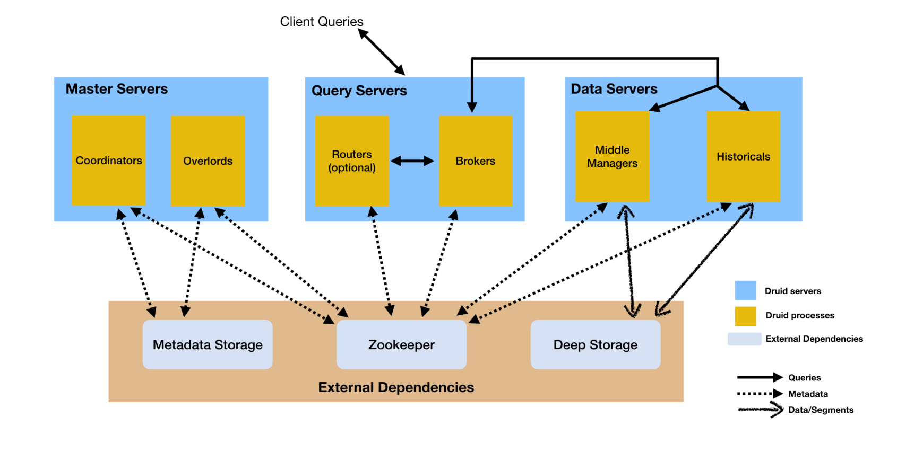
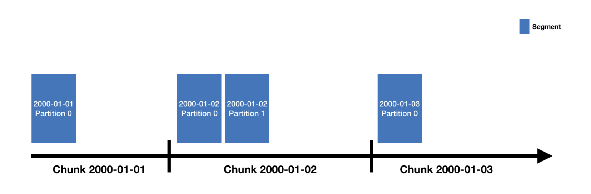

# Design

- ```text
   Druid 是一个多进程, 分布式, 被设计成云原生且易操作.
   每一个Druid进程都能独立的配置和独立伸缩, 给你最大的自由度.
   这样的设计同样增强了容错能力: 一个组件失效不会直接影响其他组件.
   ```

# [Process and Servers](https://druid.apache.org/docs/latest/design/architecture.html#processes-and-servers)

## Druid 以下有几种进程, 如下:

- [Overload](03-overload.md)
- [MiddleManager](04-middleManager.md)
- [Coordinator](05-coordinator.md)
- [Historical](06-historical.md)
- [Broker](07-broker.md)
- [Router]

## 架构图
- - 

Druid 进程能被任意部署, 但是为了部署简单, 我们推荐区分三种Server Type:

- Master
    - Run Coordinator and Overload process.
- Query
    - Run Broker and optional Router process.
- Data
    - Run Historical and MiddleManager process.

# External dependencies

# [Deep storage](https://druid.apache.org/docs/latest/design/architecture.html#deep-storage)

- Druid 使用 deep storage 存储ingested数据, deep storage 可以是hdfs, s3 等分布式文件系统.
- Druid 使用 deep storage **仅作为数据的备份, 用来在后台进程间(historical)数据传输的方式**.
- To respond to queries(响应查询), **historical 不能read from deep storage,而是从historical本地磁盘获取segment**. 这意味着Druid 查询时不需要访问
  deep storage. 也意味着在deep storage和historical之间, 必须有足够的磁盘空间(local disk),用来 load 指定时间段的segment.
- Deep storage 是druid 弹性, 容错的重要的组成部分. Druid 能在个别 historical 丢失状态时 bootstrap from deep storage.
- 详细, 请看[Deep Storage](https://druid.apache.org/docs/latest/dependencies/deep-storage.html)

# Metadata storage

- RDBMS
    - PostgreSQL
    - MySQL

# Zookeeper

- Used for internal service discovery, coordination and leader election.
- 也就是控制节点和数据节点的通信

# Architecture diagram

- 

# Storage design

- ## [Datasources and segments](https://druid.apache.org/docs/latest/design/architecture.html#datasources-and-segments)
    - Each datasource is partitioned by time 并且可以使用其他属性分区.
    - Each time range is called a "chunk"(例如, 1天, 如果你的DataSource is partitioned by day). 一个chunk, 数据 partitioned 1个或多个 "
      segment".
    - Each segment is a single file, 通常包含几百万行数据.segment被组织到chunk中,可以想象成下面的时间轴:
        - 
    - A datasource 可能有几个segment, 也有可能有几百万个segment.
    - Each segment 的生命周期从a middleManager开始, At this point(此刻), 他是可变的和未知的. 构建segment的处理过程包含以下过程, segment被设计成a data file
      压缩并且支持快速查询.
        - Conversion to columnar format
        - Indexing with bitmap indexes
        - Compression using various algorithms
            - Dictionary encoding with id storage minimization for String columns
            - Bitmap compression for bitmap indexes
            - Type-aware compression for all columns
        - 周期性的, segments are committed and published. At this point(此刻), segment
          将被写入 [deep storage](https://druid.apache.org/docs/latest/design/architecture.html#metadata-storage), become
          immutable(变为不可变),并且 move from MiddleManage to the Historical process. 这时 segment
          相关信息将被写入 [metadata store](https://druid.apache.org/docs/latest/design/architecture.html#metadata-storage)
            - 写入metadata store条目是关于segment的metadata包含 segment schema, size, location on deep storage.
              这些信息被Coordinator用来了解集群应该后那些数据可以用.
        - Segment file format: [segment files](https://druid.apache.org/docs/latest/design/segments.html)
        - 建立数据模型: [schema design](https://druid.apache.org/docs/latest/design/segments.html)
- ## [Indexing and handoff](https://druid.apache.org/docs/latest/design/architecture.html#indexing-and-handoff)
    - Indexing is the mechanism by which new segments are created, and handoff is the mechanism by which they are
      published and begin being served by Historical processes.
    - indexing是创建新segment的机制，而handoff是publish new segment 并开始由Historical进程加载(服务)的机制。
        1. Indexing task start running and building a new segment. 必须确定segment的identifier在开始构建之前.对于一个appending task(
           例如kafka task, 或append模式下的index task)将会调用 "allocate" API在Overload上, 以便潜在的将new partition 添加到现有的segment.
        2. 如果 indexing task 是 realtime task那么segment此刻能立即被查询, 这个segment available, but unpublished.
        3. 当indexing task finished, 它会push segment to deep storage and publishes it 通过写record在metadata store.
        4. 如果 indexing task 是 realtime task, 此刻它将等待Historical进程 load the segment. 如果indexing task 不是realtime task就直接退出.
    - Coordinator/Historical 方面:
        1. Coordinator polls the metadata store periodically(周期性的, 默认1minute) for newly published segment.
           Coordinator定期轮询 metadata store 获取 published segment.
        2. 当Coordinator finds a segment is published ,but unabailable,it chooses a Historical进程去load
           这个segment并且指示Historical load.
        3. Historical load the segment and begins serving it.
        4. 此刻, 如果 the indexing task was waiting for handoff, it will exit.
- ## [Segment identifiers](https://druid.apache.org/docs/latest/design/architecture.html#segment-identifiers)
    - Segment 有4段标识符, 如下:
        - Datasource name
        - Time interval
            - segment 包含的 time chunk. 对应 specified 在 ingestion 时设置的 **segmentGranularity**.
        - Version number
            - 通常是 ISO8601 时间戳对应segment首次开始时间.
        - Partition number
            - integer, 在 datasource+interval+version下唯一,不一定连续.
    - ```text
      ${datasourceName}_${timeInterval}_${versionNumber}_${partitionNumber}
      例如:
      clarity-cloud0_2018-05-21T16:00:00.000Z_2018-05-21T17:00:00.000Z_2018-05-21T15:56:09.909Z_1
      ```
- ### [Segment versioning](https://druid.apache.org/docs/latest/design/architecture.html#segment-versioning)
    - segment file 首次创建时间
    - 支持批处理模式覆盖,
- ## [Segment lifecycle](https://druid.apache.org/docs/latest/design/architecture.html#segment-lifecycle)
    - Each segment 都有生命周期, 包括以下三个主要领域:
        1. Metadata store
            - Segment metadata (a small JSON payload a few KB) is stored in the metadata store 当segment is done being
              constructed.
            - inserting a record of segment into the metadata store is called publishing.
            - 这个 metadata recodes have a boolean flag named used, 用户控制segment是否可查询.
            - realtime task 创建的segment在publish之前可用.
        2. Deep storage
            - a segment is done being constructed 将会 pushed to deep storage, 这发生在metadata to the metadata store 之前.
        3. Availability for querying
            - segment 被用于对外提供查询, realtime task 或者Historical进程.
    - 可以通过Druid SQL查询 sys.segments 表 inspect the state of currently active segments, 这个表济洛路了如下信息:
        - is_published
        - is_available
        - is_realtime
        - is_overshadowed

# [Query processing](https://druid.apache.org/docs/latest/design/architecture.html#query-processing)

- 查询请求首先到达 broker,broker 将确认哪些segment可能属于该查询. segment list 总是 pruned by time. 有时也 pruned by other attributes.
- broker 会确认query segment 存在哪些 historical 和 middleManager 然后发送重写的子查询到想用节点, historical和middleManager进程将会处理子query,
  返回结果给broker, broker收到results后merge多个节点返回的结果返回给调用者.
- broker pruning是druid限制每次查询必须扫描数据的一个重要的方法, 但不是唯一方法, 对于broker pruning 更细粒度的 filter,
  每个segment的索引结构允许druid在查看任何数据之前确定哪些行匹配 filter. 一旦druid知道哪些字段匹配一个特定的查询, 就会只访问查询所需的特定列.
- So druid用了三个不同的技术最大化查询效率:
    - Pruning which segments are accessed for each query.
    - Within each segment, using indexes to identify which rows must be accessed.
    - Within each segment, only reading the specific rows and columns that are relevant to a particular query.
- 更多查询相关请看: [Query execution](https://druid.apache.org/docs/latest/querying/query-execution.html)

# 参考资料

- [druid的基础架构与应用](https://mp.weixin.qq.com/s/a5F48l9XYi09zeVtL2xXeQ)
- [Apache Druid 的集群设计与工作流程](https://mp.weixin.qq.com/s/wPDdXU3dIvt-yZ-u5AmC9g)