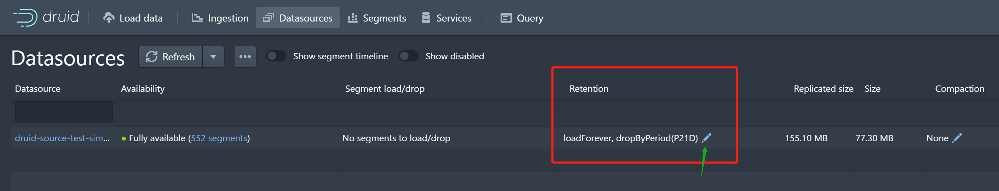

# 使用导读(基本使用)

## 1. 加载数据

- Load data from kafka
    - [使用可视化UI load kafka data, 定义数据源](https://druid.apache.org/docs/latest/tutorials/tutorial-kafka.html#loading-data-with-the-data-loader)
    - [直接api定义数据源](https://druid.apache.org/docs/latest/tutorials/tutorial-kafka.html#submit-a-supervisor-directly)
- [Load data from hadoop](https://druid.apache.org/docs/latest/tutorials/tutorial-batch-hadoop.html)

## 2. 查询数据

- 界面查询
- rest api 查询
    - http-client
    - curl

## 3. Roll-up

- Roll-up可以理解为预聚合, 可以减少存储使用量.
  [Roll-up](https://druid.apache.org/docs/latest/tutorials/tutorial-rollup.html)

## 4. Configuring data retention

- 设置数据保留和删除规则, 作用在数据源之上.
    - http://<BrokerHost>:8888/unified-console.html#datasources
        - 