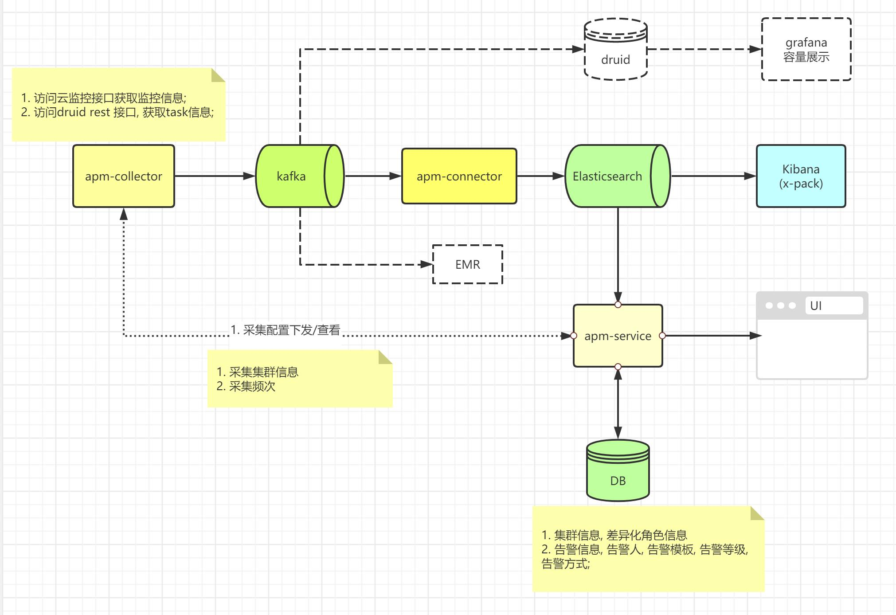

# druid 诊断&告警工具
- 集群体检
    - 容量管理 - 
        - 容量展示
            - 硬件层面
                - 集群Node: cpu, 内存, 磁盘容量
                - IO
                    - 磁盘IO延迟, 磁盘IO利用率
                    - 网络IO
            - druid 进程层面
                -  jvm, gc
                    - 可用/最大
                    - gc次数&时间
                - 线程池容量, 队列容量, 线程数, ...
                - 响应时间
                    - overload 响应时间
                    - task 响应时间
            - task 层面
                - task slots 占用量
                - task processed 数据量
        - 容量建议
            - 根据容量管理模块指标, 结合既定规则给出建议
                - 系统容量建议
                    - 内存, 磁盘IO
                - 进程容量建议
                    - 进程jvm信息, 线程池信息
                - task 容量建议
                    - task processed 数据量, task建议
                    - task slots 建议
    - 性能管理
        - 吞吐
            - 单位时间处理的数据条数或数据流量
        - qps
            - 单位时间内的查询数
            - druid 查询延迟
- 集群紧急诊断
    - 定位问题
        - 缩小定位范围, 定位问题
            - 硬件问题定位
            - 组件问题定位(包含依赖组件, 遇到过zk问题)
                - 组件状态
                    - overload/ task 响应时间
                - 组件配置
            - task 问题定位
                - supervisor 状态
                     - PENDING, RUNNING, UNHELTH_SUPERVISOR ...
                - task 状态
                    - PENDING, RUNNING, FAILED
                - task 配置问题校验
                - task split pending 次数
                    - 是否IO等待
                    - 是否handoff延迟(deepstorage or historical 延迟)
                - 获取DataSource维度下, 各task 异常日志, 汇总, 例如规则引擎分析或线性回归
                - 是否磁盘IO延迟
    - 性能分析
        - 系统瓶颈定位
            - 硬件瓶颈
            - druid组件瓶颈
            - task处理瓶颈
 - 告警模块
     - 告警信息定义
         - 告警阈值定义
         - 告警级别定义
         - 告警模板定义
         - 告警方式定义
             - 一期暂时仅支持微信机器人告警
         - 告警目标定义

# 简要设计
- 设计图(其中彩色为一期内容)
  - 
  - druid + grafana 主要用于容量展示, 可替代
  - kafka落EMR适用于druid日志深度分析, 目前druid日志没有收集